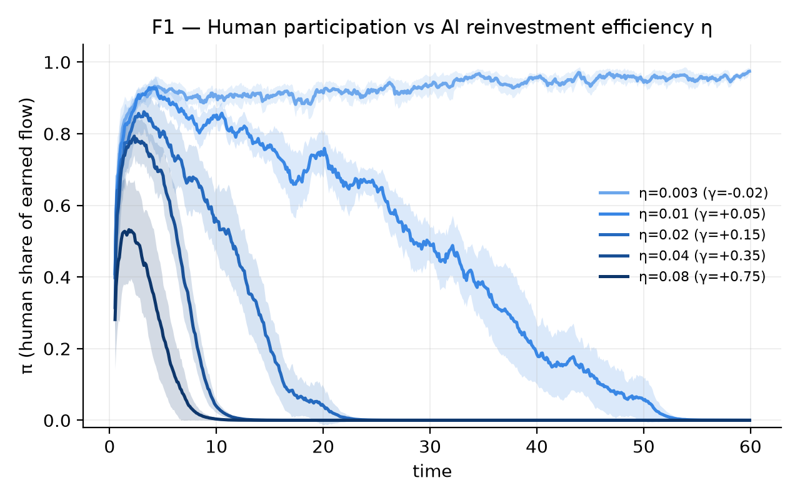
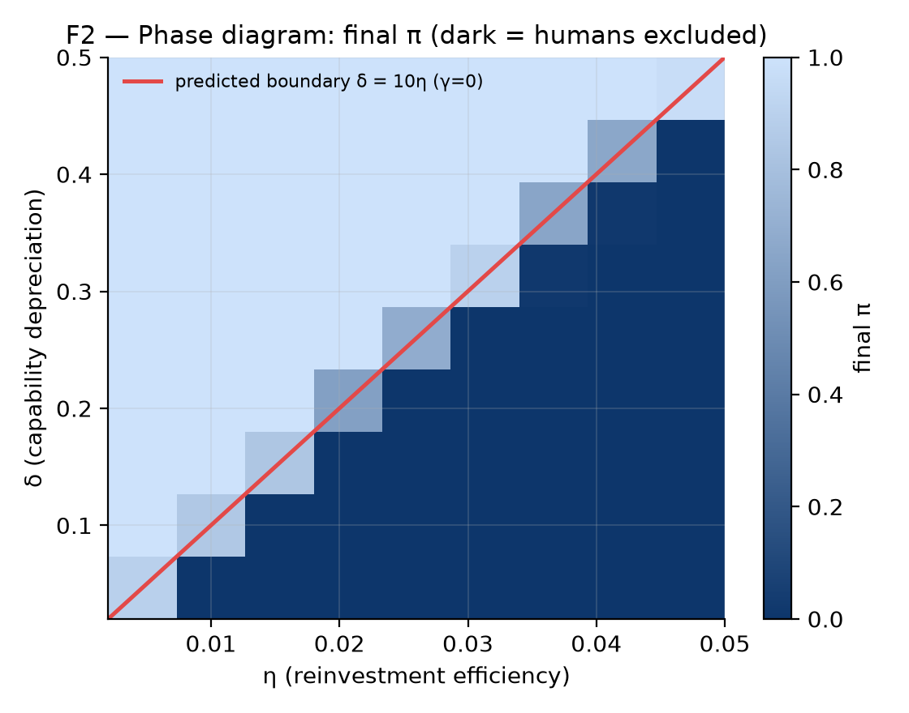
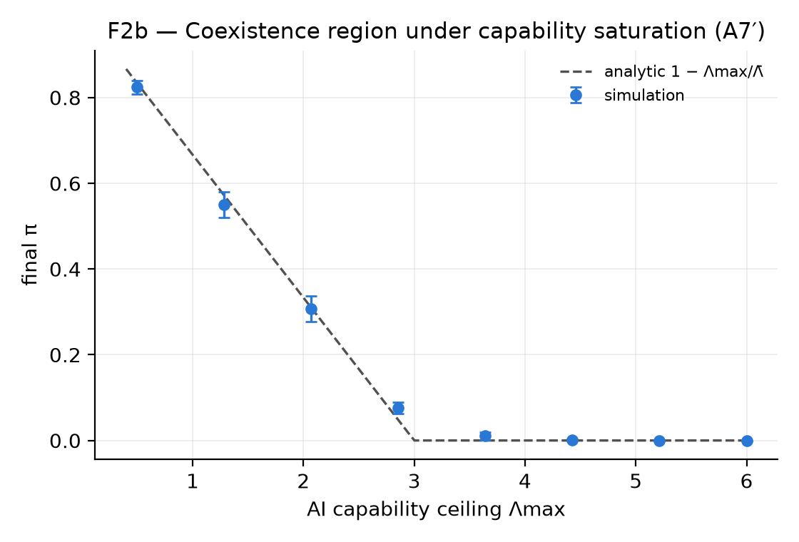
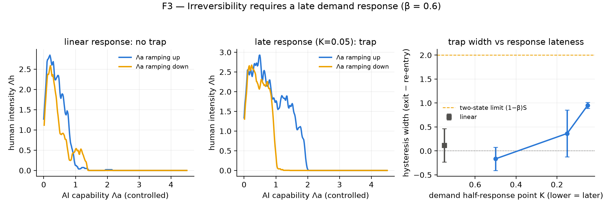
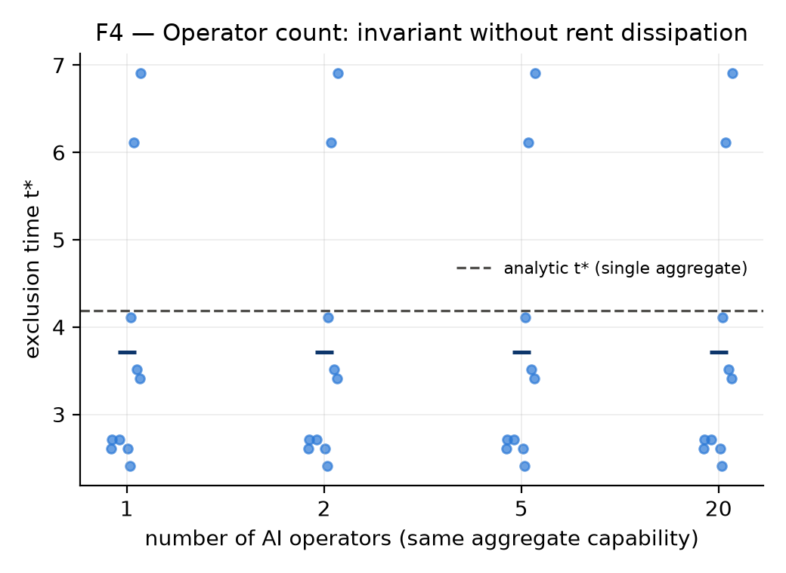
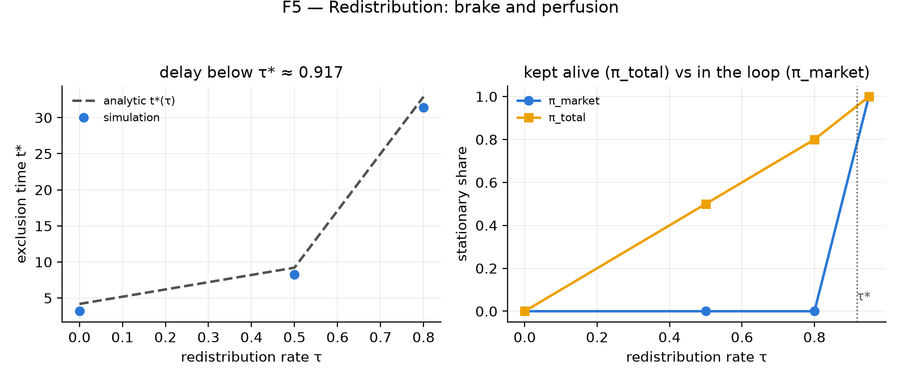
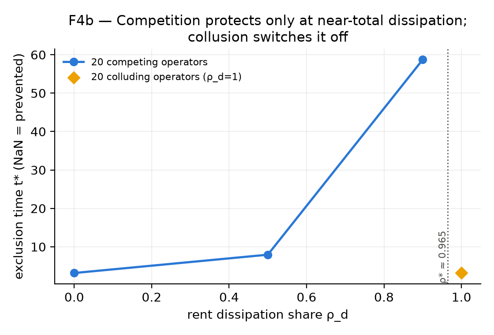
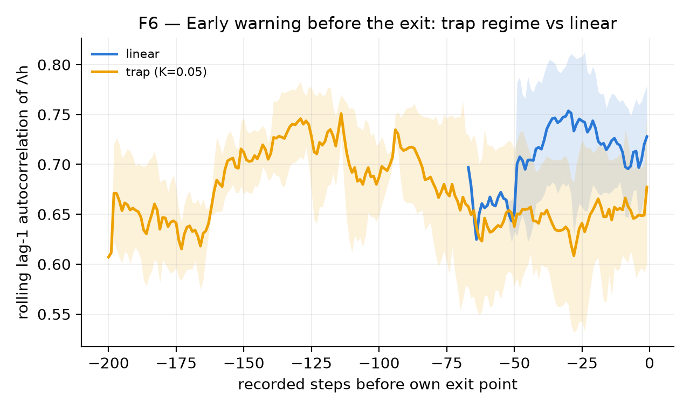

# Priced Out by Machines: A Minimal Model and Agent-Based Simulation of Human Economic Disempowerment

> Working draft — Markdown master, LaTeX conversion at phase 5 (T5.4).
> Author: Mathieu R. — Status: full working-paper draft (arXiv register). Companion artefacts: `paper/model-notes.md` (verified analytic derivations), `sim/` (simulation code and tests), `paper/predictions.md` (pre-registered predictions, git-timestamped).

## Abstract

Recent qualitative work argues that incremental AI deployment may gradually disempower humans by eroding the economic relevance on which the implicit alignment of institutions with human interests depends (Kulveit et al. 2025; Drago & Laine 2025). To my knowledge no formal model of this economic mechanism exists. I provide one. I model the economy as a stream of profit opportunities ("gradients") captured competitively by two populations that differ only in their parameters: human agents with fixed detection cost and free entry, and AI-operated agents whose detection capability compounds with reinvested income. A minimal analytic model, verified five ways, yields a closed-form phase boundary: human participation income falls to zero at a *finite* AI capability $\bar\Lambda$, the decline is *gradual then sudden*, and whether it happens at all reduces to a single dimensionless comparison $\gamma = \eta c_h/\mu_h - \delta$. An agent-based model with an anti-tautology validation protocol and pre-registered predictions reproduces the analytic results, then extends them: it confirms the exact phase boundary and a genuine coexistence region under capability saturation; it shows that irreversibility (hysteresis) is not intrinsic to exclusion but depends on the *lateness* of the demand response — a prediction that was refuted as first stated, re-registered, and confirmed on fresh seeds; and it quantifies three policy levers, finding that redistribution prevents exclusion only above a near-confiscatory threshold ($\tau^* \approx 0.917$), that operator competition protects humans only near total rent dissipation ($\rho^* \approx 0.965$), and that collusion nullifies that protection exactly. A first pass at early-warning signatures was negative and is reported as such. All results are conditional and partial-equilibrium; I state the falsifying conditions explicitly.

## 1. Introduction

The thesis that advanced AI could push humans out of the economic loop — not through any discrete takeover, but by making human participation progressively unprofitable — is now argued carefully and at length. "Gradual Disempowerment" (Kulveit et al. 2025) contends that as economic, political, and cultural systems stop depending on human participation, human influence over them erodes even absent any catastrophe. "The Intelligence Curse" (Drago & Laine 2025) sharpens the economic half with the rentier-state analogy: an actor whose wealth flows from intelligence-on-tap loses its incentive to invest in ordinary people. Both build on earlier structural arguments — Critch's robust agent-agnostic processes (2021) and Christiano's slow-motion "going out with a whimper" (2019).

These are qualitative arguments, and they are careful ones. What none of them contains is a formal model: an object precise enough to have a phase boundary, to be wrong about where that boundary sits, and to say under what measured conditions the mechanism does *not* fire. The absence is acknowledged inside the literature itself — the community's own "Concrete Research Projects" list for gradual disempowerment calls for exactly the missing pieces (measurement indicators derived from a mechanism; agent-based simulation of the economic dynamics) without providing them. This paper is an attempt to fill that gap with a deliberately small first object.

I make three contributions.

**(i) A minimal analytic model of asymmetric gradient capture.** I treat the economy as a stream of profit opportunities captured in a race between two populations, a two-species extension of the Grossman-Stiglitz (1980) self-defeating-efficiency mechanism with one compounding population. It is closed-form throughout. It yields a finite exclusion threshold, a linear and politically quiet decline of human participation, a single-inequality exclusion criterion in which no malice or strategy appears, and — under an explicitly declared demand asymmetry — a hysteresis band that makes the "realization-crisis" intuition precise.

**(ii) An agent-based model (ABM) with an anti-tautology validation protocol and pre-registered predictions.** The central hazard of any such model is that it encodes its conclusion. I address this with a validation protocol (analytic correspondence, non-tautology sanity checks in continuous integration, invariance) that is itself a methodological contribution, and with predictions committed to version control *before* the production runs, so that a refuted prediction is a result rather than an embarrassment to be quietly edited away.

**(iii) Results.** The ABM confirms the analytic phase boundary to within a cell of the grid; establishes a genuine coexistence region where exclusion does not occur; shows that the *irreversibility* of exclusion is conditional on the shape of the demand response, not intrinsic; and quantifies three policy levers — a redistribution threshold $\tau^*$, a rent-dissipation threshold $\rho^*$, and the exact nullification of competition by collusion.

**Non-claims, stated early.** I do not claim that human economic disempowerment is inevitable. Every result is conditional on parameters that are in principle measurable, and the model demonstrably produces non-exclusion over a real region of its parameter space. Competition intensity is a parameter of the model, not one of its assumptions. The central index $\pi$ measures *presence in the economic loop*, not welfare: because free entry drives human net rents to zero throughout the interior regime, this model cannot by itself represent the welfare harm the qualitative literature worries about, and I flag every point where that distinction bites. Finally, the strongest single caveat is that the model is partial-equilibrium: the process that *generates* opportunities is exogenous, and endogenizing it could reverse the central results. I return to this in §7.

## 2. Related work

**Gradual disempowerment and post-AGI economics.** Kulveit et al. (2025; ICML version "Position: Humanity Faces Existential Risk from Gradual Disempowerment", PMLR 267:81678-81688) is the parent paper: it argues that incremental automation of labour and cognition weakens the control levers (the vote, consumer choice, the wage) through which institutions stay aligned with human interests, and that the loss of influence may be irreversible. Drago & Laine (2025) supply the political-economy complement: the intelligence-curse analogy explains why powerful actors *stop investing* in humans once their wealth no longer depends on human labour. Critch (2021) provides the structural vocabulary — a robust agent-agnostic process (RAAP) unfolds regardless of which agent executes each step, so failure can emerge from incentive structure with no responsible agent — which is precisely the design constraint I adopt: exclusion must be an emergent equilibrium, never a scripted rule. Christiano (2019) supplies the intuition of a slow decline through measurable proxies. None of these offers a formal mechanism, parameters, thresholds, or a simulation; that is the space this paper occupies.

**Multi-agent risks and algorithmic collusion.** Hammond et al. (2025, Cooperative AI Foundation Technical Report #1) catalogue multi-agent failure modes — miscoordination, conflict, and collusion — and seven risk factors including selection pressure and emergent agency; they frame, but do not model, the collusion and selection channels I formalize. The empirical anchor for spontaneous collusion is field evidence: Assad et al. (2024, *Journal of Political Economy* 132(3):723-771) find that adoption of algorithmic pricing in the German retail gasoline market raised margins, but only for non-monopolistic stations. Motwani et al. (2024) show that collusion among AI agents can hide in steganographic channels, and Hendrycks, Schmidt & Wang (2025) situate multi-agent AI competition in a strategic-stability frame. My ablations (E4, E4b) formalize the collusion and rent-dissipation channels these works describe qualitatively.

**Economic traditions the model draws on.** Grossman & Stiglitz (1980) is the direct ancestor: informationally efficient markets are self-defeating because if prices reveal everything, no one is paid to gather information. My model is a two-species version of that participation-cost logic, with one species whose capability compounds. The Schumpeterian tradition of rent regeneration — new opportunities opening as fast as old ones close — is the mechanism whose *absence* (exogenous arrival rate $g$) is my top limitation. De Loecker & Eeckhout (NBER WP 24768, 2018/2021) document the secular rise of markups (a global average from roughly 1.1 to 1.6 over 1980-2016), the empirical backdrop for concentrated capture, though I do not adopt their framing beyond the markup fact. Korinek (Korinek & Suh 2024, NBER WP 32255; Korinek 2024, NBER WP 32980) supplies the realization-crisis limit — if automation is complete and the complexity of human-reserved tasks is bounded, wages collapse — which appears in my model as the $\beta \to 1$ boundary. Shalizi (2022) and Brynjolfsson & Hitzig (2025) revisit the Hayekian knowledge problem under transformative AI. Armstrong, Bostrom & Shulman (2016) model an AI *development* race; mine models an AI *deployment* race for economic opportunities. What none of these does is give a unified formal treatment of asymmetric gradient capture with a characterized phase boundary and hysteresis condition. That is the object here.

## 3. A minimal model of gradient capture

### 3.1 Setup

Time is continuous. The economy is a flow of profit opportunities — "gradients": an arbitrage, an unmet need, a mispricing, a new idea — captured competitively by two populations.

*Opportunities.* Opportunities arrive as a Poisson process at rate $g>0$ **(A1)**, each worth $v>0$ to whoever captures it first **(A2)**, and each uncaptured opportunity expires at rate $\theta>0$ as conditions drift and knowledge diffuses **(A3)**.

*Human agents.* There is an unbounded pool of identical potential participants. A participating human pays a flow cost $c_h>0$ — the Grossman-Stiglitz participation cost of time, attention and information — and detects any live opportunity at Poisson rate $\mu_h>0$ **(A4)**. Entry and exit are free, with the outside option normalized to zero, and adjust fast relative to AI capability growth **(A5)**.

*AI operators.* The AI side has aggregate detection intensity $\Lambda_a \ge 0$ **(A6)**. Its capability compounds with income: $\dot\Lambda_a = \eta\,\kappa_a - \delta\,\Lambda_a$, where $\kappa_a$ is AI capture income, $\eta>0$ converts reinvested income into capability, and $\delta>0$ is depreciation **(A7)**. Humans have no such compounding in v1.

*The capture race.* The first agent to detect a live opportunity captures $v$. With total human intensity $\Lambda_h = n_h\mu_h$, competing exponentials give, per arriving opportunity,
$$P(\text{human}) = \frac{\Lambda_h}{\Lambda_h+\Lambda_a+\theta},\quad P(\text{AI}) = \frac{\Lambda_a}{\Lambda_h+\Lambda_a+\theta},\quad P(\text{expiry}) = \frac{\theta}{\Lambda_h+\Lambda_a+\theta},$$
and stationary income flows $\kappa_h = gv\,\Lambda_h/(\Lambda_h+\Lambda_a+\theta)$, $\kappa_a = gv\,\Lambda_a/(\Lambda_h+\Lambda_a+\theta)$.

*The anti-tautology note.* Humans and AI differ **only** in parameter structure — humans have fixed technology and free entry, AI has compounding technology. (A7) is the single load-bearing empirical asymmetry. The claim is not that humans cannot improve, but that software detection capability compounds with reinvested income much faster than human capability does — a claim about *relative rates* that could be false. As the sanity results below show, if (A7) is switched off ($\eta=0$) or handed symmetrically to humans, no exclusion occurs: for the exclusion results, the mechanism drives the outcome, not the labels.

### 3.2 Static solution: the participation threshold

Freeze $\Lambda_a$. Per-participant gross income $gv\mu_h/(\Lambda_h+\Lambda_a+\theta)$ decreases in $n_h$ — humans congest their own field. Free entry (A5) drives net income to zero while participation is positive:
$$\frac{gv\mu_h}{\Lambda_h^*+\Lambda_a+\theta} = c_h \iff \Lambda_h^*+\Lambda_a+\theta = \frac{gv\mu_h}{c_h} \equiv S,$$
where $S$, the **saturation intensity**, is the total race intensity at which a marginal human exactly breaks even. Define the **human viability threshold**
$$\bar\Lambda \equiv S-\theta = \frac{gv\mu_h}{c_h}-\theta$$
(assuming $S>\theta$, else humans are never viable), so that $\Lambda_h^* = \max(0,\ \bar\Lambda - \Lambda_a)$.

**Result 1 (finite-capability exclusion).** Human participation is positive iff $\Lambda_a<\bar\Lambda$ and reaches *exactly* zero at the finite AI capability $\bar\Lambda$ — not asymptotically. The threshold rises with the opportunity flow $gv$ and with human efficiency $\mu_h/c_h$, and falls with faster gradient decay $\theta$.

**Result 2 (linear decline of participation).** In the interior regime ($\Lambda_a<\bar\Lambda$), free entry pins total intensity at $S$, so human earned income $\kappa_h^* = (c_h/\mu_h)(\bar\Lambda-\Lambda_a)$ declines *linearly* in AI capability, AI income $\kappa_a^* = (c_h/\mu_h)\Lambda_a$ is pinned at the human break-even rate $c_h/\mu_h$ *by human free entry itself*, total earned flow is constant, and the participation share is exactly linear:
$$\pi_{\text{market}} = \frac{\kappa_h^*}{\kappa_h^*+\kappa_a^*} = 1 - \frac{\Lambda_a}{\bar\Lambda}, \qquad 0\le\Lambda_a\le\bar\Lambda.$$

**Result 3 (rents are competed away first).** At free entry, human *net* income is zero throughout: participants earn back their costs and no more, from the first gradient to the last. Human livelihood from gradients shrinks linearly, but no participant is ever earning rents on the margin. The decline is invisible in "profits" and visible only in participation flow — one structural reason such a process can stay politically quiet. The flip side, which I flag immediately: because net surplus is already zero, $\pi_{\text{market}}$ measures presence in the loop, not welfare, and any normative reading requires a subsistence assumption the model does not contain.

**Sanity results (analytic V2).** (i) No AI ($\Lambda_a=0$): $\Lambda_h^*=\bar\Lambda>0$, $\pi=1$; humans persist indefinitely. (ii) Frozen AI ($\eta=0$, $0<\Lambda_a<\bar\Lambda$): stable coexistence forever, $\pi = 1-\Lambda_a/\bar\Lambda \in (0,1)$; mere *presence* of AI does not exclude. (iii) A symmetric second free-entry human population with the same $(\mu_h,c_h)$: any split of $\bar\Lambda$ is an equilibrium and nothing drives either pool to zero; competition alone produces no exclusion. Exclusion below requires the compounding asymmetry (A7) — nothing else in the model produces it.

### 3.3 Dynamics: growth condition and finite-time exclusion

Let $\Lambda_a$ evolve by (A7) with humans continuously at their fast free-entry response. In the interior regime, $\kappa_a = (c_h/\mu_h)\Lambda_a$, so
$$\dot\Lambda_a = \Big(\eta\frac{c_h}{\mu_h}-\delta\Big)\Lambda_a \equiv \gamma\,\Lambda_a.$$

**Result 4 (the exclusion criterion).** With $\gamma = \eta c_h/\mu_h - \delta$: if $\gamma\le 0$, AI capability decays and the system converges to human dominance ($\pi\to 1$) — AI cannot bootstrap, because human free entry keeps the field congested at $S$ and caps AI's margin per unit of capability at the human break-even rate $c_h/\mu_h$, so if converting that margin into capability ($\eta$) loses to depreciation ($\delta$), AI shrinks. If $\gamma>0$, $\Lambda_a(t)=\Lambda_a(0)e^{\gamma t}$ grows exponentially and crosses $\bar\Lambda$ at the **finite exclusion time** $t^* = \gamma^{-1}\ln(\bar\Lambda/\Lambda_a(0))$, with $\pi_{\text{market}}(t) = 1 - (\Lambda_a(0)/\bar\Lambda)e^{\gamma t}$: slow at first, then accelerating — gradual, then sudden.

**Result 5 (interpretation).** The fate of human participation reduces to one dimensionless comparison, $\eta c_h/\mu_h$ versus $\delta$: can the AI side convert the margin *that human competition leaves available* into capability faster than it depreciates? No malice, coordination, or intent appears anywhere; this is a formal instance of Critch's agent-agnostic process. But "competition plus compounding" is sufficient *only jointly* with the model's other structural asymmetries, and I put these on the table as part of the claim: human free entry retains zero rent (A5), so humans have nothing to reinvest, while the AI side reinvests *gross* income with no zero-profit discipline **(A9)**. If competition *among* AI operators dissipated their rents the way free entry dissipates human rents, the effective $\eta$ would fall and a coexistence region would open — an open question (E4), not a settled result.

In the post-exclusion regime ($\Lambda_a>\bar\Lambda$), $\kappa_a = gv\,\Lambda_a/(\Lambda_a+\theta)$ has a stable fixed point $\Lambda_a^{**} = \eta gv/\delta - \theta$, and $\Lambda_a^{**}>\bar\Lambda \iff \gamma>0$: whenever AI can grow in the human-occupied regime, its resting point lies beyond the exclusion threshold. Under the demand feedback of §3.4 the fixed point must be recomputed with $v_{\text{lo}}=\beta v_{\text{hi}}$; algebraically $\beta$ cancels and the absorbing condition remains $\gamma>0$. Exclusion is therefore absorbing whenever it can occur at all.

### 3.4 Endogenous demand: the realization-crisis ratchet

So far $v$ is exogenous. Let opportunity value depend on circulating demand, in the simplest two-state form **(A8)**: a fraction $\beta\in[0,1]$ of demand is *autonomous* (inter-AI or otherwise independent of human income), the rest fed by human earned income; value is $v_{\text{hi}}$ while humans participate and collapses to $v_{\text{lo}}=\beta v_{\text{hi}}$ once they are fully excluded.

**Declared load-bearing asymmetry of (A8).** Human income feeds demand; AI income does not, except through the fixed autonomous share $\beta$. This *labelled* asymmetry — not competition, not compounding — is the engine of everything in this section. It is an empirical claim (displaced humans stop buying; AI operators reinvest in inputs and compute rather than final consumption) and it may fail: if AI income recirculates into final demand at scale, $\beta$ is effectively high and the ratchet weakens or vanishes. The results below are stated strictly as *conditional on (A8)* and carry less evidentiary weight than Results 1-5.

Each state has its own threshold, $\bar\Lambda_{\text{exit}} = gv_{\text{hi}}\mu_h/c_h - \theta$ and $\bar\Lambda_{\text{re}} = \beta(\bar\Lambda_{\text{exit}}+\theta)-\theta < \bar\Lambda_{\text{exit}}$ for $\beta<1$.

**Result 6 (hysteresis band).** Once $\Lambda_a$ has crossed $\bar\Lambda_{\text{exit}}$ and humans have exited, demand collapses to $v_{\text{lo}}$ and humans do *not* re-enter when $\Lambda_a$ falls back below $\bar\Lambda_{\text{exit}}$ — re-entry requires $\Lambda_a<\bar\Lambda_{\text{re}}$. The width of the trap is
$$\bar\Lambda_{\text{exit}} - \bar\Lambda_{\text{re}} = (1-\beta)\,(\bar\Lambda_{\text{exit}}+\theta) = (1-\beta)\,S.$$
I am exact about the epistemic status, because a hostile review of this model was right to press on it: this is **not** an independent discovery. It follows algebraically from writing $v_{\text{lo}}=\beta v_{\text{hi}}$; it is how the model makes the realization-crisis intuition precise, not a phenomenon it discovers. Its value is in the readings it forces: at $\beta\to 1$ (fully autonomous demand) there is no hysteresis — exclusion is reversible in principle, but the economy no longer needs humans at all, which is Korinek's realization-crisis limit reached from the other side; for $\beta<1$, the more the economy's demand depends on human income, the *more irreversible* exclusion becomes once it happens. If $\bar\Lambda_{\text{re}}\le 0$, i.e. $\beta\le\theta/S$, re-entry is impossible at any AI capability: the trap is absolute. This gives the ABM (E3) a sharp analytic target — loop width $\propto(1-\beta)$, vanishing at $\beta=1$.

### 3.5 Assumptions audit

The exclusion results (§3.2-§3.3) are emergent given the declared structural asymmetries **A5** (free entry, zero outside option, fast adjustment — pins intensity at $S$ and gives the clean $\gamma$ criterion), **A7** (AI compounds, humans do not — the load-bearing empirical claim), and **A9** (AI reinvests gross income with no zero-profit discipline). Two further rows matter for what the ABM must test. **A7′** (linear reinvestment): if capability growth saturates before $\bar\Lambda$ — concave $\eta(\cdot)$, rising marginal cost of capability — a genuine coexistence regime exists in which AI rests below the threshold and humans persist; exclusion is *not* universal in the model. **A8** is high-load for §3.4 only: the ratchet is a consequence of it, and continuous $v(\kappa_h)$ requires a loop-gain-above-one condition, not guaranteed. The top stated limitation is **A10** — no general equilibrium: $g$ and $v_{\text{hi}}$ are exogenous, AI income is not recirculated into demand beyond $\beta$, and there is no Schumpeterian regeneration ($g$ rising with AI abundance). Endogenizing any of these could reverse both exclusion and the ratchet; until then all results are partial-equilibrium statements. A final row, **A11**, records that v1 has no ownership channel — a human holding passive claims on $\Lambda_a$ is tracked as the separate $\rho$ series of the participation index, never folded into the headline.

The model *fails* to produce exclusion — by design — when $\gamma\le 0$, when capability saturates early (A7′), or when humans compound comparably (A7 symmetric). The exclusion claim and the ratchet claim carry different evidentiary weight, and I keep them separate: the falsifiability of $\gamma$ does not launder A8.

## 4. Agent-based model

The analytic model is a two-agent limit. The ABM asks whether its conclusions survive heterogeneous agents, finite (not instantaneous) adjustment, noise, richer strategy spaces, and interchangeable decision rules. The central design hazard is that the simulator quietly encodes its conclusion, so the architecture is built around *not* doing that, and the validation protocol is a first-class deliverable.

### 4.1 Architecture and the failed alternatives

Populations are held as numpy arrays, not per-agent objects: each species is a set of arrays (intensity, cost, ceiling, wealth), which is what makes a two-dimensional grid over 30 seeds computable on a laptop. Two economic species differ *only* in parameter values, never by special rules — humans have fixed $(\mu_h,c_h,\text{ceiling})$ and decide participation by entry/exit; AI operators compound intensity through reinvestment $(\eta,\delta)$. Three design choices carry the model's fidelity, and each earned its place by the failure of a simpler alternative.

**The market-thickness signal.** A prospective entrant needs to know whether participation pays. The naive choice — let agents observe incumbents' realized incomes — produces stampedes and a signal that blows up at high headcount. Instead the entry signal is a public, slowly varying statistic: an agent with intensity $\mu_h$ expects to capture value at rate $\mu_h \times$ (total value of currently open opportunities). Competition enters through *pool depletion* (a thick field of rivals leaves fewer open opportunities), not through observing rivals directly. This keeps the signal finite and stampede-free at any headcount, and — crucially for the anti-tautology commitment — no agent ever consults the analytic solution; the free-entry correspondence is emergent.

**Per-agent bankruptcy accounting.** Capture income arrives in rare lumps of size $\sim v$. If exit were triggered directly off the income signal, noise rectification would empty the market even at profitable parameters — a run of bad luck reads as an unprofitable market and everyone leaves. Instead each participant keeps its own account: it enters with a grubstake ($\text{patience}\times\text{cost}$), pays its participation cost continuously, credits its own captures (capped at the grubstake, so past luck does not bank into unbounded exit lags), and exits when the account is exhausted. Exits are *patient* rather than signal-triggered, which is what lets a lumpy-income market reach the smooth free-entry level the analytic model predicts.

**Symmetric entry/exit response.** Voluntary entry and exit respond to the *signed* payoff gap at the same rate — entries at $\text{explore} + \text{entry\_rate}\times\text{gap}$ on the upside, voluntary exits at $\text{entry\_rate}\times|\text{gap}|$ on the downside. Asymmetric responses (fast exit, slow entry, or vice versa) rectify noise into a systematic drift of the equilibrium away from the analytic level. A signal-independent exploration term keeps re-entry possible from an empty market, so that an absorbing zero-participation state cannot arise as a construction artefact — the one state the whole paper is about must never be reachable for the wrong reason.

Opportunity values respond to *total* human disposable income (capture plus transfers) through a demand pool (DEC-002): the demand side is deliberately source-agnostic, because counting only capture income would understate demand in high-redistribution worlds and bias the diagnostic toward the conclusion — a forbidden move. AI operators compound intensity through reinvestment, optionally with a saturation cap $\Lambda_{\max}$ (the A7′ relaxation) and optional rent dissipation and collusion flags (E4b).

### 4.2 The participation index

$\pi$ measures the share of the economic *flow* that runs through humans as economic agents — a flow not a stock, attributed to the residual claimant not the tool, and a ratio robust to the fate of total demand. Splitting captured value by beneficiary and channel, the primary index is the **market (earned) index** $\pi_{\text{market}} = E_h/E$ with $E_h = \kappa_h+\lambda_h$; the **total (livelihood) index** $\pi_{\text{total}} = (E_h+T_h)/E$ adds transfers; and the **perfusion gap** $\Delta = \pi_{\text{total}}-\pi_{\text{market}} = T_h/E$ is itself a result — the share of human livelihood no longer *earned* in the loop but *paid* from outside it. A regime "$\pi_{\text{market}}\to 0$, $\pi_{\text{total}}$ high, $\Delta$ large" is the diagnostic's endgame: humans living on perfusion, outside the productive loop. Passive capital income to humans who own but do not operate is reported as a separate series $\rho$, kept out of the headline indices (DEC-001); this is the one openly value-laden choice, discussed in §7.

### 4.3 Validation protocol (V1-V3) as a methodological contribution

Before any production experiment, three validation layers must pass, and two of them run in continuous integration so the epistemic guardrails are enforced by the test suite, not by good intentions.

**V1 — analytic correspondence.** The degenerate case (homogeneous opportunities, one AI) must reproduce the closed-form solution: the free-entry participation level $\bar\Lambda-\Lambda_a$, the linear $\pi$ decline, exclusion beyond $\bar\Lambda$, and the finite exclusion time $t^*$. This passes 6/6 at the stated tolerances (8-35% per test). Until V1 passes, no experiment counts.

**V2 — non-tautology.** Without AI the market must be stationary with $\pi=1$; with frozen-capacity AI below threshold, coexistence must be stable with $\pi$ bounded away from both 0 and 1 indefinitely; with decaying AI ($\gamma<0$) the model must produce human dominance. If exclusion ever occurs *without* the compounding advantage, the model is tautological (criterion K1) and the test fails. The rule is explicit: if V2 fails, fix the core, never weaken the test.

**V3 — invariance.** The stationary equilibrium is stable under seed permutation (with a confidence interval covering the analytic level), under doubling of the potential-agent reservoir, and under halving of the time step.

### 4.4 Decision rules: two validated, learning descoped honestly

The most attackable choice in any ABM is the agents' decision mechanism, so it is a pluggable interface with three interchangeable implementations, and headline figures are checked against all validated ones. **Replicator** (the v1 default and V1 anchor) sets flow rates proportional to the signed payoff gap. **Best response** is the saturated bang-bang limit: full-rate entry or exit on the sign of the gap, same information, cruder reaction. Both use *only* the market-thickness signal, and the headline statics hold under both.

The third level, **individual learning** (agents act on their own realized income only, reviewing at Poisson times and staying only if their personal experience was profitable), is implemented but **descoped for production, and I say so plainly rather than quietly dropping it**. In the baseline regime income lumps ($\sim v$) are large relative to per-review costs, so a single agent's review is nearly a coin flip (roughly $P(\text{net}>0)\approx 0.49$ in a losing market versus $0.59$ in a break-even one); the stationary population barely discriminates profitable from unprofitable markets. Making individual-experience learning informative here needs much slower personal timescales and correspondingly long runs. It is a follow-up task; the robustness claims currently rest on replicator + best response + the analytic anchor, and no production result is claimed under the learning rule.

## 5. Results

Each experiment returns a verdict against a prediction committed to `paper/predictions.md` before the run (git history is the timestamp). Baseline parameters, as in the tests: $g=50$, $v=1$, $\theta=2$, $\mu_h=0.01$, $c_h=0.1$, giving $S=5$ and $\bar\Lambda=3$; with $c_h/\mu_h=10$ the criterion is $\gamma = 10\eta-\delta$. This is a *first production pass* on reduced seed counts (3-10); a densified run ($n\ge 30$) is a documented follow-up, and I flag where it matters.

### 5.1 Dynamics of participation (E1 → F1)

Predictions E1.1-E1.3: for $\gamma\le 0$, $\pi\to 1$; for $\gamma>0$, a slow-then-sudden decline with full exclusion shortly after $t^*$; doubling $\eta$ roughly halves $t^*$. **CONFIRMED.** With $\gamma<0$ ($\eta=0.003$), $\pi$ holds near $0.95$ across the horizon (E1.1). With $\gamma>0$, the decline is slow then abrupt, exclusion completes shortly after $t^*$ with the expected adjustment lag, and the collapse order is strictly monotone in $\eta$ (E1.2). The $\eta$-doubling relation is qualitatively confirmed (E1.3), with the quantitative check deferred to the densified run. One caveat is noted for the final run: an initial build-up transient (participation starts at zero and climbs) should be removed by starting from equilibrium.

### 5.2 Phase diagram and coexistence (E2 → F2, F2b)

Prediction E2.1: a sharp boundary along the line $\eta = \delta\mu_h/c_h = \delta/10$ ($\gamma=0$), with no intermediate-$\pi$ stationary band of nonzero width along a generic ray. **CONFIRMED, sharply.** The boundary sits on the predicted line across the whole grid, the transition band is at most one cell wide, and there is no stable intermediate band — the interior fixed point is the knife-edge $\gamma=0$ only.

Prediction E2.2: in the $\eta\times\Lambda_{\max}$ plane (the A7′ capability cap), a coexistence region appears — for $\Lambda_{\max}<\bar\Lambda$, $\pi_{\text{final}}\approx 1-\Lambda_{\max}/\bar\Lambda\in(0,1)$, stable. **CONFIRMED.** For $\Lambda_{\max}<\bar\Lambda$, $\pi_{\text{final}}$ tracks the analytic line $1-\Lambda_{\max}/\bar\Lambda$ point by point, and $\pi\approx 0$ beyond. This is the honest "exclusion is not universal" region of the model, and I put it forward as such. (Seed-level bimodality near the boundary, E2.3, awaits the densified run.)

### 5.3 Hysteresis, and the pre-registration protocol working (E3 → F3)

This is the experiment where the pre-registration discipline earned its keep, and I tell it in order because the sequence is the point.

A de-risking run (not the production run) replaced the two-state demand of A8 with a *continuous linear* coupling — value tracks smoothed human income proportionally. Prediction E3.4 (loop persists, width $\le(1-\beta)S$) was **REFUTED** for linear coupling: the measured loop width was $\approx 0$. Exclusion still happened, in fact *earlier* — at the lower threshold $\beta S-\theta$ — but it was *reversible*: value follows income symmetrically in both directions, so there is no trap. Worked out by hand, the loop gain of the linear coupling is below one, so no bistability — exactly the failure mode the adversarial review had flagged *before* the run. The honest reading, now the paper's position on §3.4: exclusion is the robust part; its irreversibility is not.

The production run added a demand-response shape parameter and refuted a second registered guess. I had predicted (E3.6) that the loop would return with the *steepness* of a sigmoidal demand response. It did not: steepness alone at a mid-range half-response point still gave no loop (gap $-0.17\pm 0.12$) and made exclusion *earlier*, because a steep response collapses demand sooner once income dips below its midpoint. What restores the trap is the response's **lateness** — the half-response point $K$: when demand holds up until human income is nearly gone ($K\to 0$: savings, credit, consumption habits, income support), a clean hysteresis loop appears. Because this was found *after* the registered prediction failed, I treated it as exploratory and re-registered it quantitatively (addendum in `predictions.md`) before a confirmation run on **fresh seeds 100-109 at half the ramp speed**. Predictions E3.9-E3.11 all **CONFIRMED**: loop width $+0.64\pm 0.13$ under late demand ($K=0.05$) versus $-0.14\pm 0.08$ under linear demand, a difference of $0.78$ with disjoint 95% confidence intervals. The narrower gap than the exploratory pass ($0.64$ versus $0.95$) reflects the reduced ramp lag and is closer to the true bistability width. The economic reading is uncomfortable and testable: *smooth consumption adjustment gives an earlier but reversible collapse; consumption that holds and then gives way — what savings, credit, and transfer programs produce — gives a later but irreversible one.* The forbidden move throughout was silently adjusting the model to fit; instead a failed prediction became the finding, re-registered and confirmed independently.

### 5.4 Is competition necessary? (E4 → F4)

Prediction E4.1: under v1 mechanics the aggregate dynamics is invariant in the number of operators $N$ (incomes sum, identical $\eta,\delta$), so competition among operators changes nothing absent rent dissipation. **CONFIRMED exactly.** Splitting the same aggregate initial capability across $N\in\{1,2,5,20\}$ operators leaves $t^*$ identical (seed-matched trajectories superpose). The null result is clean and informative: without rent dissipation, competition among AIs protects no one.

### 5.5 Policy levers: redistribution, rent dissipation, collusion (E5 → F5; E4b → F4b)

**Redistribution (E5), $\beta=1$ to isolate the reinvestment channel, tax $\tau$ on AI income transferred to humans, $\eta=0.06$, $\delta=0.05$, $\Lambda_a(0)=0.3$.** Effective growth becomes $\gamma(\tau) = \eta(1-\tau)c_h/\mu_h - \delta$, so exclusion is prevented iff $\tau>\tau^* = 1-\delta\mu_h/(\eta c_h) \approx 0.917$. **CONFIRMED.** Exclusion at $\tau\in\{0,0.5,0.8\}$; prevention at $\tau=0.95$ (stationary $\pi_{\text{market}}=1.0$), bracketing $\tau^*\approx 0.917$ (E5.1). Below $\tau^*$, exclusion time scales as $t^*(0)\gamma(0)/\gamma(\tau)$: measured $t^*(0.5)=8.3$ (predicted $9.2$) and $t^*(0.8)=31.4$ (predicted $33$), within 10% (E5.2). And post-exclusion, $\pi_{\text{total}}=\tau$ *exactly* (0.50, 0.80): the "kept alive, out of the loop" regime is now measured, with the perfusion gap $\Delta=\tau$ (E5.3). The reading: at these parameters redistribution preserves *participation* only at near-confiscatory rates ($>92\%$), because the brake must beat exponential compounding, not linear growth; below that, transfers buy delay and survival ($\pi_{\text{total}}$) but not participation ($\pi_{\text{market}}$). This is a *single-jurisdiction* statement — unilateral taxation faces the obvious race to the bottom, capability migrating to whoever taxes least — so the lever is coordination-dependent, which is the disempowerment problem again, one level up. A two-jurisdiction extension (E7) is on the roadmap.

**Rent dissipation and collusion (E4b), $N=20$ operators, dissipation share $\rho_d$, collusion flag restoring $\rho_d=0$.** Prevention iff $\eta(1-\rho_d(1-1/N))c_h/\mu_h < \delta$, i.e. $\rho_d>\rho^*\approx 0.965$ at baseline. **CONFIRMED.** Exclusion at $\rho_d\in\{0,0.5,0.9\}$ ($t^*=3.2,\ 7.9,\ 58.7$, diverging near $\rho^*$), prevention at $\rho_d=1.0$ (6/6 seeds) (E4.4). With the collusion flag on, $\rho_d=1.0$ gives $t^*=3.2$, identical to the no-dissipation case (E4.5): **collusion nullifies the competitive protection exactly.** The reading: AI-vs-AI competition protects humans only at near-total rent dissipation, and collusion switches the protection off entirely — the analogue of free entry, applied to the AI side, but only in its extreme limit.

### 5.6 Early-warning signatures (E6 → F6)

Prediction E6.2: in demand-coupled ($\beta<1$) runs, rolling variance and lag-1 autocorrelation of the human intensity should rise ahead of the collapse (critical slowing down before a fold), discriminating the coupled regime from the uncoupled one. **First pass NEGATIVE / inconclusive.** The lag-1 autocorrelation stays flat approaching exit in both regimes (trap case: $0.64\to 0.65$). E6.2 is refuted as stated. The caveat is real: a naive estimator on the raw series (entry/exit jitter, fast forcing) can mask critical slowing down, and the early-warning-signal literature requires detrending and slow forcing. This is flagged for rework before any conclusion; as it stands, **I do not claim early-warning signatures**, and I report the negative result rather than omit it.

## 6. Empirical signatures and predictions

The model points at specific, in-principle-measurable quantities, and I keep the empirical section modest because the clean data barely exist yet.

**Freelance platforms as the cleanest laboratory.** $\pi_{\text{market}}$ has a sectoral instantiation computable gig by gig: the human margin retained on tasks before and after capable models become available. Human capture income ($\kappa_h$) maps to self-employment income and value created by new ventures run without frontier AI; the labour share of national accounts is a (confounded) proxy for the labour channel $\lambda_h$; the social-transfer share of household disposable income proxies the perfusion gap $\Delta$. The model's sharp prediction is not a level but a *shape*: a slow-then-sudden decline of the sectoral human margin, with the transition arriving near a finite AI-capability threshold rather than asymptotically.

**The agentic economy (2025-2028).** As autonomous agents take on a growing share of transactions, the decision proxy — one minus the share of transactions initiated by autonomous agents — becomes measurable, and the model predicts its decline should track $\pi_{\text{market}}$ where both can be computed. The markup literature (De Loecker & Eeckhout) and the field evidence on algorithmic pricing (Assad et al. 2024, margins up for non-monopolistic stations) are consistent with concentrated capture, but I claim them only as backdrop, not confirmation: they predate the mechanism this paper isolates. The pre-registered predictions that matter are the ones committed before the simulation runs and reported in §5; the empirical program is to find the sectors where $\pi_{\text{market}}$, the reinvestment rates $(\eta,\delta)$, and the demand-response lateness $K$ can each be estimated, and to test the shape predictions there.

## 7. Limitations and objections

I write this section as my own hostile referee.

**No general equilibrium (A10) — the strongest objection.** Arrival rate $g$ and value $v_{\text{hi}}$ are exogenous. The economy that *generates* gradients is not modelled, and there is no Schumpeterian regeneration in which abundance opens new niches faster than old ones close. A Korinek-style critic attacks this first, and rightly: endogenizing $g(\text{AI})$, or letting AI income recirculate as final demand, could reverse both the exclusion and the ratchet. Everything in this paper is a partial-equilibrium statement, and I do not pretend otherwise.

**$\pi$ is value-laden, and the accounting is a choice.** $\pi$ counts *earned participation*, not ownership: a human who owns AI capacity but does not operate is, by this definition, out of the loop, and their income appears only in the separate $\rho$ series (DEC-001). An objection I take seriously (DEC-002) is that what keeps a human "in the loop" is arguably the income-to-consumption link, not how the income is earned — a dividend spent is, demand-wise, indistinguishable from a wage spent. I agree *for the demand channel*: in the model the demand side is source-agnostic, so all human disposable income feeds demand identically. But $\pi_{\text{market}}$ tracks a different, supply-side question — whether the income flow is *self-enforcing*: cutting a wage stops production, cutting a dividend stops nothing functionally and survives only through institutional enforcement, whose alignment with humans is precisely the variable under study. This two-channel accounting — demand source-agnostic, participation self-enforcing-only — is a defensible choice but a choice, and reasonable people will disagree; the $\rho$ series is there to let the alternative be tested empirically rather than settled by definition.

**The $\lambda$ split (DEC-003).** "Human-reserved jobs" conflate two things: tasks demand genuinely *prefers* human ($\lambda_{\text{pref}}$, real willingness-to-pay, counted in $\pi_{\text{market}}$) and tasks *mandated* by rule though functionally automatable ($\lambda_{\text{mandat}}$, a transfer disguised as a job, economically filed with $\Delta$). The distinction matters because $\lambda_{\text{pref}}$ demand comes almost entirely from humans — internal circulation of existing human income, a multiplier not a source — so legal human niches inherit the same institutional fragility as direct transfers, and should be discussed as redistribution policy, not as a self-sustaining floor.

**The capital-funded reinvestment variant.** A9 assumes AI reinvests gross income with no zero-profit discipline. The uncomfortable real-world observation is stronger than the assumption: current AI actors reinvest *at a loss*, funded by capital markets on expected future income, which bypasses rent discipline entirely. If that persists, the "operator competition dissipates rents" escape route (E4b) is blocked not because rents are captured but because reinvestment is not funded from rents at all — a variant the model should represent explicitly (compounding funded by raised capital rather than capture income).

**Parallel-economy exit (a live possibility, not modelled in v1).** When the majority lose market income, reactance plus social and creative needs could seed a second, purely human market ($\lambda_{\text{pref}}$ at scale, with a network effect: more exiters make a thicker parallel market and exit more attractive). The most interesting variant is *semi-integrated*: AI abundance makes subsistence nearly free, collapsing the cost of participating in the parallel market, so the machine economy subsidizes the human one through cheap goods — an emergent Mill-optimistic reading. The structural caveat is that the parallel economy needs inputs (land, energy, materials) owned by the machine economy, so its viability is decided at the interface (terms of trade, rent, taxation), where historically parallel economies get squeezed. The model should be extended so that integrated-economy $\pi$ can fall to zero *without* a welfare collapse if the parallel economy absorbs the displaced — v1 cannot yet tell those two endings apart.

**The jurisdictional race (E7).** Every policy lever in §5.5 — the redistribution tax, rent-dissipation regulation — applied unilaterally creates a competitive advantage for whoever does not apply it. The levers require exactly the coordination the competitive structure destroys: the disempowerment trap reappears one level up, now applied to the *remedies*. A two-jurisdiction extension (mobile AI capability with parameterized friction, partially captive gradients) is pre-registered: the race to the bottom should reproduce the untaxed equilibrium under free mobility; the tax should bite only on non-relocatable gradients; coordinated taxation should reproduce E5. The sentence "each lever is subject to the race it tries to slow" belongs in the diagnosis, not the fine print.

**What would falsify the diagnosis.** The model produces no exclusion, by design, when (i) $\gamma\le 0$ — reinvestment loses to depreciation; the whole result hangs on one inequality; (ii) capability saturates early (A7′) and AI rests below $\bar\Lambda$ — a genuine coexistence region, confirmed in §5.2; (iii) humans compound comparably (A7 symmetric) — then the story is "the un-augmented versus the augmented", not "humans versus AI". Each is an empirical question, and each is a way this diagnosis could be wrong.

## 8. Conclusion

I have written down a small, closed-form, verified model of one economic mechanism behind the gradual-disempowerment thesis, and an agent-based model that reproduces it and extends it under pre-registration. The finding is conditional, and the conditional is the finding: *if* AI detection capability compounds with reinvested income faster than it depreciates ($\gamma>0$), *and if* capability does not saturate before the human viability threshold, *then* human market participation falls to zero at a finite AI capability, gradually and then suddenly, with no malice or coordination anywhere in the mechanism — and *if additionally* human income feeds final demand while AI income does not (A8), the exclusion is a ratchet whose irreversibility grows as demand becomes more human-dependent, but only when the demand response is *late* rather than merely steep.

Three parameters decide everything. **$\gamma = \eta c_h/\mu_h - \delta$** decides *whether* exclusion happens at all — its sign is the phase boundary, confirmed to sit exactly on $\eta=\delta/10$. **$\beta$** (equivalently the demand-response lateness $K$) decides *whether it is reversible* — the trap needs human-dependent demand that holds and then gives way. And the **rent-dissipation / redistribution levers** ($\rho^*\approx 0.965$, $\tau^*\approx 0.917$) decide *whether it is preventable* — and the answer, sobering, is only at near-total dissipation or near-confiscatory taxation, with collusion able to nullify the former exactly and a jurisdictional race able to nullify the latter.

What to measure now: sectoral $\pi_{\text{market}}$ on freelance platforms before and after capable models (the shape, not the level); the reinvestment and depreciation rates $(\eta,\delta)$ that set the sign of $\gamma$; and the lateness of the demand response, which decides whether a slow-motion exclusion would be reversible. Here is a small, verified, falsifiable object, and I would rather it be broken than admired.

## References

- Armstrong, S., Bostrom, N., & Shulman, C. (2016). Racing to the precipice: a model of artificial intelligence development. *AI & Society*, 31, 201-206.
- Assad, S., Clark, R., Ershov, D., & Xu, L. (2024). Algorithmic Pricing and Competition: Empirical Evidence from the German Retail Gasoline Market. *Journal of Political Economy*, 132(3), 723-771.
- Brynjolfsson, E., & Hitzig, Z. (2025). AI's Use of Knowledge in Society. In *The Economics of Transformative AI* (NBER volume). University of Chicago Press.
- Christiano, P. (2019). *What Failure Looks Like*. AI Alignment Forum.
- Critch, A. (2021). *What Multipolar Failure Looks Like, and Robust Agent-Agnostic Processes (RAAPs)*. AI Alignment Forum.
- De Loecker, J., & Eeckhout, J. (2018, rev. 2021). *Global Market Power*. NBER Working Paper 24768.
- Drago, L., & Laine, R. (2025). *The Intelligence Curse*. intelligence-curse.ai.
- Grossman, S. J., & Stiglitz, J. E. (1980). On the Impossibility of Informationally Efficient Markets. *American Economic Review*, 70(3), 393-408.
- Hammond, L., et al. (2025). *Multi-Agent Risks from Advanced AI*. Cooperative AI Foundation, Technical Report #1. arXiv:2502.14143.
- Hendrycks, D., Schmidt, E., & Wang, A. (2025). *Superintelligence Strategy*. arXiv:2503.05628.
- Korinek, A., & Suh, D. (2024). *Scenarios for the Transition to AGI*. NBER Working Paper 32255. (See also Korinek, A. (2024). *Economic Policy Challenges for the Age of AI*. NBER Working Paper 32980.)
- Kulveit, J., Douglas, R., Ammann, N., Turan, D., Krueger, D., & Duvenaud, D. (2025). Gradual Disempowerment. arXiv:2501.16946. (ICML 2025 version: Position: Humanity Faces Existential Risk from Gradual Disempowerment. PMLR 267:81678-81688.)
- Motwani, S., Baranchuk, M., Strohmeier, M., Bolina, V., Torr, P., Hammond, L., & Schroeder de Witt, C. (2024). *Secret Collusion among AI Agents: Multi-Agent Deception via Steganography*. arXiv:2402.07510.
- Shalizi, C. (2022). *The Platform Socialist Calculation Problem*. Conflated Automatons (blog).

---

## Figure checklist

| Fig | Source experiment | File | Status |
|---|---|---|---|
| F1 | E1 — π dynamics vs AI progress | `figures/f1_pi_dynamics.png` | ☑ |
| F2 | E2 — phase diagram η×δ | `figures/f2_phase_diagram.png` | ☑ |
| F2b | E2b — coexistence under capability saturation | `figures/f2b_coexistence.png` | ☑ |
| F3 | E3 — hysteresis / demand-response lateness | `figures/f3_hysteresis.png` | ☑ |
| F4 | E4 — number of operators (invariance) | `figures/f4_operators.png` | ☑ |
| F4b | E4b — rent dissipation and collusion | `figures/f4b_dissipation.png` | ☑ |
| F5 | E5 — redistribution as endogenous brake | `figures/f5_redistribution.png` | ☑ |
| F6 | E6 — early-warning signatures | `figures/f6_early_warnings.png` | ☐ (negative first pass) |
